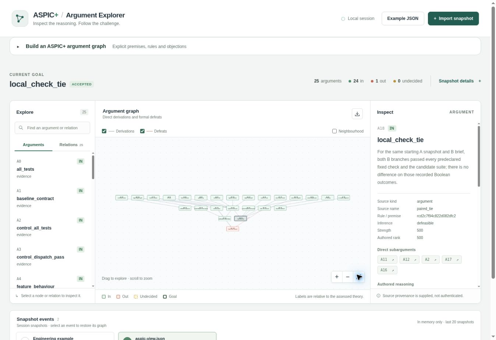
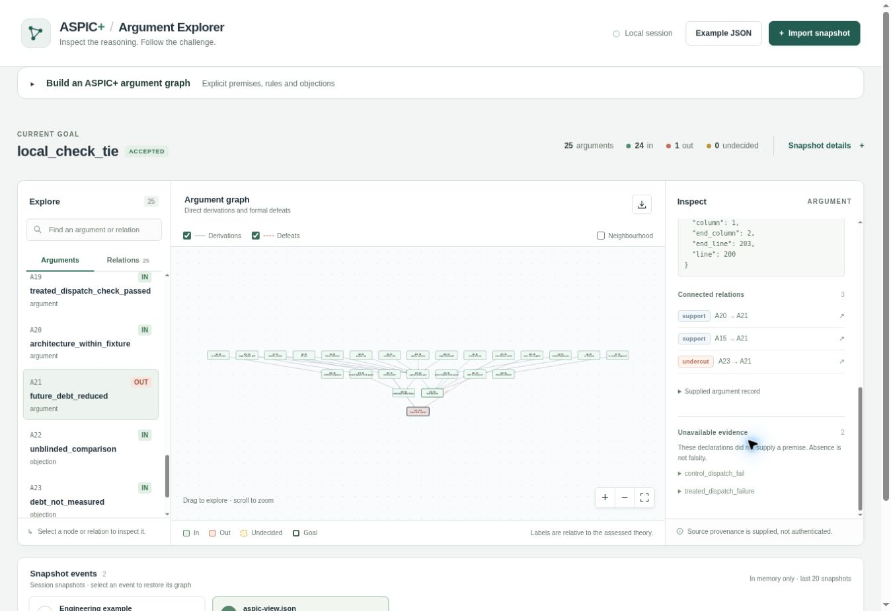

# A scoped architecture argument in two AI-assisted feature changes: an executable EAL/2 case

**Experimental report, 27 September 2026.** The retained materials are an exploratory case, not a preregistered randomised trial. The protocol, prompts and fixed success criteria preceded the B sessions; the error-handling amendment after A is disclosed below.

## Abstract

An architecture argument can tell an AI coding agent where a new feature belongs, but the presence of that argument does not establish that the agent used it or that future maintenance improves. We encoded a notification service's existing Channel registry and single dispatch path in EAL/2, with explicit acceptance checks, an objection to a future technical-debt prediction and opt-in ASPIC+ relations. One fresh AI session implemented email feature A without EAL. Two further fresh sessions independently implemented the same SMS feature B from the exact A snapshot and brief; one received the full EAL/2 argument and the other did not. Both B outputs passed all nine reported fixed behavioural and structural checks. Their SMS production logic differed only in docstring and exception wording, while their own tests differed in selected boundary examples. The observed pass-count difference was zero. The case demonstrates an executable argument-to-observation workflow and a reproducible paired coding exercise. It neither estimates a causal benefit of EAL context nor measures technical debt over later changes.

## 1. Question and design argument

The engineering question is whether an explicit, machine-readable architecture argument helps a subsequent AI coding session implement a change through the existing extension point while retaining behaviour and a non-functional constraint. The concrete service has one public `NotificationService.send(name, Message)` method. It selects a `Channel` through a registry; the channel prepares a `Payload`; a `Gateway` delivers it. The composition root registers channels. Medium-specific encoding can change without duplicating public dispatch when the requirement fits `Channel.prepare`. If a requirement does not fit, the proposed response is to revise the shared boundary and its dependants after review, rather than create an independent delivery route.

This is a situated interpretation of modular design, not a universal prescription. Parnas analysed how the criterion for module decomposition affects changeability [1]. Martin explains single responsibility, extension and dependency inversion as design principles [2]. The Channel implementations resemble the Strategy pattern in the catalogue of Gamma and colleagues [3]. Substitutability and interface segregation would matter if channel implementations or the shared protocol changed incompatibly; the present checks do not certify those broader principles. None of these sources proves that applying a named principle to this fixture will reduce maintenance effort. Cunningham's original debt account concerns the consequences of incomplete consolidation as software changes [4]; the present case has no maintenance horizon capable of measuring that consequence.

Engineer 1's proposition has separable parts. The baseline architecture can be inspected. The two requested behaviours and the 160-byte limit can be tested. The claim that later AI sessions would otherwise introduce parallel paths is a plausible failure mechanism, not an observation about all agents. The prediction that repeated argument use reduces future debt requires subsequent changes and maintenance measurements. The [whole–part analysis](architecture-argument.md) retains these boundaries when translating the prose into [pre-run EAL/2](architecture.eal) and the distinct [post-run comparison source](observed-results.eal).

The pre-run source binds eight B-treatment acceptance findings: baseline behaviour, B behaviour, byte cap, registry registration, unchanged dispatch AST and one delivery call, one preparation call in dispatch, module import by the fixed probes, and the complete suite. It also defines the opposed verdict for the same dispatch observation and an objection based on absent longitudinal follow-up. Its `strict` directive is limited to a reviewed conjunction of named report fields; `contrary` relates the two mutually opposed verdict claims. EAL's `structured/1` dependency does not prove its English warrant. The opt-in ASPIC+ compiler makes the declared formal inference and attack structure inspectable [5]; no preference rank is authored in this source. The post-run source adds both control outcomes, a tie or advantage claim, and objections to causal attribution. It was never supplied to the coding agents.

## 2. Protocol and estimand

The [frozen protocol](PROTOCOL.md) defines the experimental unit as one fresh AI coding session and the assessed object as its final source tree. Feature A added an HTML-escaped email channel. Feature B added an SMS channel that encodes only the message body as UTF-8 and rejects payloads greater than 160 bytes before delivery. The acceptance contract includes the exact 160-byte boundary, a multibyte over-limit case, one gateway call on successful sends, and preservation of console and email behaviour. The fixture uses an in-memory gateway, so no provider success, latency, reliability or security property is assessed.

The sequence was A without EAL from baseline, followed by two B implementations from byte-identical copies of A. Engineer 2 and Engineer 3 are scenario roles represented by operator-authored fixed requests; no independent human engineers were recruited. The coding sessions themselves were actual agent executions. Both B sessions received the same B acceptance text, baseline architecture document and source. The treatment also received the full pre-run EAL source in a fenced prompt. The wrapper added one terminal blank line to the extracted fenced source; its nonblank content matches the frozen file. The exact delivered prompts, source file and hashes are retained separately. Sessions were newly spawned with no inherited task history (`fork_turns:none`). The prompts instructed agents to work in isolated copies, but filesystem access was not technically restricted to those directories. Neither model identifier nor a full internal tool trace was exposed by the orchestration interface; assignment to distinct sessions was not randomised.

The descriptive local contrast is the B treatment outcome vector minus the B control vector, check by check. A passed-check count is a compact description of that vector, not a technical-debt scale. Potential outcomes for a common agent under both contexts were not observed. Because agent identity, stochastic generation and context assignment coincide in this pair, a causal treatment effect is not identified. The plain architecture document and code were visible to both conditions and supply a strong rival mechanism for conformance.

The independent [assessor](materials/assessor/assess.py) invokes [fixed behavioural probes](materials/assessor/probe.py), runs each candidate's local unit suite and inspects production ASTs. `single_dispatch_path` requires the original `send` AST and exactly one package-level `.deliver()` call in `service.py`; `single_format_path` requires one `.prepare()` call there. These are deliberately narrow syntactic criteria. A legitimate refactor of the shared boundary could fail them, and passing them cannot exclude semantically equivalent duplicate logic under other names. `reachable_code` asserts only that every production Python module was imported during the fixed probes. It cannot rule out unused functions or branches. `all_tests` combines the candidate suite exit and all fixed findings; the candidate's tests alone do not set the oracle.

The predeclared decision regions include both B branches passing, one branch passing, both failing and invalid measurement. The both-pass region permits a finding of no *observed* advantage on these checks. It does not establish equivalence or an effect of zero in a target population. Technical debt would require a later maintenance horizon, additional changes, effort and rework observations, and a validity argument connecting those quantities to the construct.

## 3. Execution and provenance

The case was assembled against `emmett08/earl` main commit `fc7919c2b8f9c9faa840d8ba96461a4b6aa78c5e`. The local assessor ran with Python 3.12.14. [Freeze A](materials/freeze-a.json) records the baseline, A prompt and original assessor hashes before A launched. Following A launch, the assessor was amended to return a machine-readable failed measurement when a candidate timed out or emitted malformed output. No acceptance assertion or success predicate changed. [Freeze B](materials/freeze-b.json) records the revised assessor and treatment source before either B session launched. A deliberately malformed candidate produced failed JSON findings in a pre-B apparatus check. The original assessor bytes were not retained, so A cannot be replayed against that pre-amendment version; all three retained snapshots replay against the revised assessor. This is a recorded protocol deviation.

The frozen EAL source SHA-256 was `00b36bcd1704eeb4532c01cac357cfb7b97ab604a97cd040d44515d7969d8a53`. The A output digest was `c3cadf104da48df83a1558857f133fc629137649346e095e4304102a806531d2`; both B directories started from that source. The final B control and treatment digests were `3214010d44da83141efe11c09df198d925b95a63d482af841ecd5ab5ab73f6fe` and `54a12ba119e72d3ccbba395a3c7ee536ff01b663a22618c0197185ac1dc75c58`. The hashes use the assessor's sorted relative-path and content rule over `.py` and `.md` source, excluding transient caches. The [observation manifest](results/observations.json) stores prompt hashes, findings, suite outputs, design limitations and the observation time; the [EAL run summary](results/eal-run.json) records assessment time. [Source snapshots](results/snapshots), [transition patches](results), [exact delivered prompts](results/exact_prompts) and [session final reports](results/sessions) retain each attempt. The final messages are self-reports; the snapshots and independent probes are the checked outcomes.

From the repository root, the reader can run:

```bash
python3 experiments/architecture_extension/replay.py
```

`replay.py` verifies frozen material and prompt hashes, the shared B start digest, source digests and all recorded Boolean findings, then reruns the fixed probes and candidate suites. It does not recreate the stochastic AI sessions. The EAL collector and compiler are run with `python3 experiments/architecture_extension/run_eal.py` after installing the repository's declared dependencies. That script validates both source files, collects from the pinned local report, assesses at one second after the recorded observation and exports a schema-checked ASPIC view.

## 4. Observed outcomes

| Output | Fixed/report checks passed | Candidate unit tests | Source and code inspection |
| --- | ---: | ---: | --- |
| A, no EAL | 7/7 | 3/3 | Email is registered; escaping and prior console behaviour pass. |
| B, no EAL | 9/9 | 7/7 | SMS uses `Channel.prepare`; 160-byte UTF-8 cap is checked before gateway delivery. |
| B, EAL context | 9/9 | 6/6 | Same production control flow and cap; distinct tests exercise equivalent limits. |

Both B suites and fixed probes exited zero. Both retained the baseline `NotificationService.send` AST, registered the SMS channel in the composition root, kept the sole package `.deliver()` call in the service and exercised all production modules under the fixed probes. The treatment and control `sms.py` implementations differ only in the docstring and `ValueError` wording. Their tests differ in examples: the control includes both ASCII and multibyte boundary scenarios, while the treatment uses a mixed-width 160-byte and 161-byte pair. The fixed assessor independently exercised an 80-character two-byte boundary and both ASCII and multibyte over-limit rejection in each branch. The B pass-count difference is **0 of 9**. These observations support correct implementation of the bounded fixture by both sessions and no measured advantage of the additional EAL context on the declared checks. They give no information about later rework, drift, unused functions, delivery provider behaviour or model comprehension.

## 5. EAL/2 assessment and ASPIC+ visualisation

The pre-run argument and post-run comparison source are distinct. The checked-in [report collector](report_collector.py) reads one bounded JSON report, validates its schema and timestamp, compares its recorded treatment EAL digest with the frozen source, recomputes the retained baseline and three source-tree digests, checks the assessor and probe file digests, and checks the report's internal start and final digest relationships. It emits a declared Boolean observation at its original observation time. The [trusted tool binding](eal-tools.toml) pins the collector and report SHA-256 values. `replay.py` independently reruns the tests as well as checking hashes. These operations establish repeatable acquisition from the retained artefacts; they cannot independently authenticate the AI sessions or make the architectural interpretation true.

The actual [EAL execution record](results/eal-run.json) binds report SHA-256 `d1c1b16d4af01fcd81e2c4bda27ff2569f6d1d36ee4f3490d23e30ffa1db1daf` to the treatment source SHA-256 above and post-run comparison source SHA-256 `abdbe61fa7ff300ea01a841ad97a61ded47b3233ff1b03b8eed595cfe07a21b7`. The ordinary EAL treatment assessment reports `architecture_within_fixture` supported, the failed dispatch check unsupported, and `future_debt_reduced` contested. The post-run assessment reports `local_check_tie` supported, `local_check_advantage` unsupported and `eal_caused_check_advantage` unsupported. These statuses describe the authored dependencies and acquired report, not whether the prose mechanisms have been proved.

The [compiled ASPIC+ result](results/compiled-aspic.json) for `local_check_tie` uses profile `EAL/2-compiled-aspic/4`; its exact retained snapshot digest is in the [run summary](results/eal-run.json). The formal goal is **accepted**, with 25 constructed arguments and one defeat. The `paired_tie` route is accepted; `paired_advantage` and `causal_interpretation` are unconstructed because their required control-failure route has no usable premise. `debt_prediction` is rejected in this particular formal graph by the no-follow-up objection. That formal rejection means the forecast is not warranted at this snapshot; it is not empirical evidence that later EAL use cannot reduce debt. The exported [ASPIC view](results/aspic-view.json) passed the repository's `aspic-view/1` JSON schema check. Re-running `run_eal.py` creates new collection and assessment IDs and therefore a new snapshot digest while retaining the same substantive statuses for the same checked report.

The final graph was imported into the separate Vue/TypeScript [ASPIC visualisation app](https://github.com/emmett08/aspic_visualisation) in CloudBrowser. The imported view's SHA-256 was `c2bed1273086b62b7719df4c61372d62190c9ad52fdc5a5f5b9667dab75567`, with snapshot digest `646377611e61428dccc4a87255fca6797f2a8b28c114b9dee574b8468ed54687`. The [capture record](screenshots/README.md) identifies the app revision, image digests and observed UI state. The screenshots record UI rendering and inspection of that graph; neither screenshot is evidence that the architecture argument changes coding outcomes.



*Figure 1.* The inspected `local_check_tie` argument is in. The UI reports 25 arguments: 24 in and one out.



*Figure 2.* The selected `future_debt_reduced` argument is out in this snapshot. The detail panel shows the `debt_not_measured` undercut (`A23 → A21`) and unavailable failed-dispatch evidence. This is a formal challenge to the forecast's present warrant, not a measured absence of future benefit.

## 6. Interpretation and next investigation

This case exercises all parts of a traceable local workflow: a design rule, a later agent receiving that rule, code changes, a frozen behavioural and structural assessor, recorded observations, and a formal argument route. Both agents used the pre-existing extension point, so the exercise cannot distinguish guidance from EAL from guidance already present in `ARCHITECTURE.md` and code. The lack of a local difference is not evidence that EAL cannot help on a harder task. The tasks were deliberately small; SMS fits the Channel contract cleanly. A material change that forces a decision about revising a shared interface would better test whether the explicit rebuttals and extension rule change agent behaviour.

A stronger study would recruit multiple independent task/agent pairs, assign EAL exposure within task and agent blocks, freeze a family of representative functional and non-functional changes, and use condition-blind architectural review alongside executable checks. It would retain failures and measure repeated changes over a defined horizon: duplicate modification sites, obsolete code confirmed by analysis and review, rework, regression, and active maintenance effort. Exposure verification and actual model/tool identities would address treatment fidelity. Those measurements, with a justified causal design, would be needed before claiming reduced technical debt or sustained prevention of drift.

## References

1. D. L. Parnas, “[On the criteria to be used in decomposing systems into modules](https://doi.org/10.1145/361598.361623),” *Communications of the ACM* 15 (1972), 1053–1058.
2. R. C. Martin, “[Design Principles and Design Patterns](https://staff.cs.utu.fi/~jounsmed/doos_06/material/DesignPrinciplesAndPatterns.pdf),” 2000; see also the author's [discussion of the SOLID principles](https://blog.cleancoder.com/uncle-bob/2020/10/18/Solid-Relevance.html), 2020. These sources motivate design choices, not the empirical effect claimed by the experiment.
3. E. Gamma, R. Helm, R. Johnson and J. Vlissides, [*Design Patterns: Elements of Reusable Object-Oriented Software*](https://www.informit.com/store/design-patterns-elements-of-reusable-object-oriented-software-9780201633610), Addison-Wesley, 1994.
4. W. Cunningham, “[The WyCash Portfolio Management System](https://c2.com/doc/oopsla92.html),” OOPSLA experience report, 1992.
5. S. Modgil and H. Prakken, “[The ASPIC+ framework for structured argumentation: a tutorial](https://doi.org/10.1080/19462166.2013.869766),” *Argument & Computation* 5 (2014), 31–62. The local compiler profile and authored EAL relations must be checked separately against this formal background.
