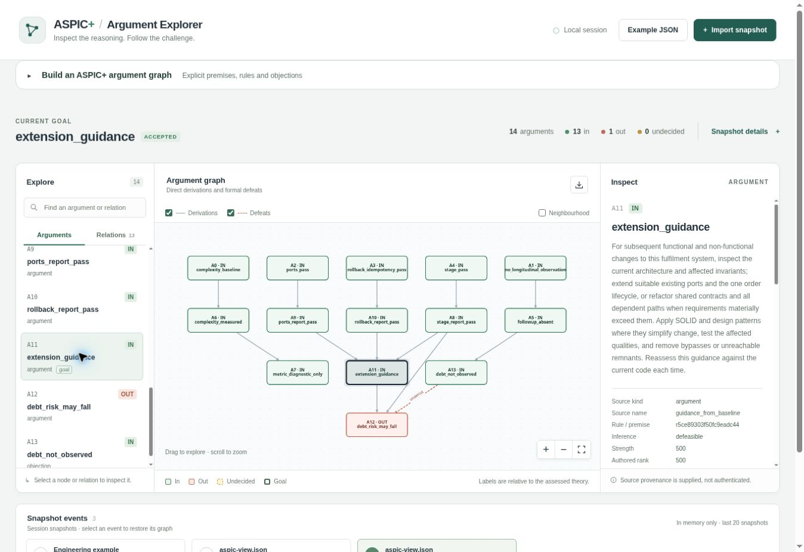
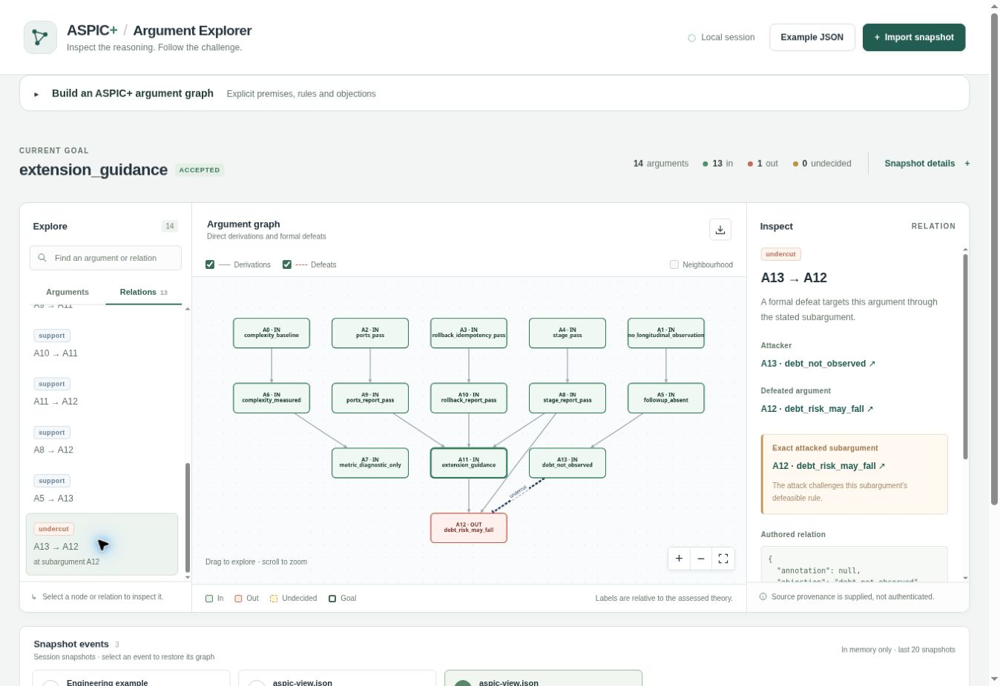

# Architecture argument exposure during split fulfilment and partial returns: a paired AI coding experiment

**Experimental report, 27 September 2026.** The protocol and measurement instruments were fixed before the coding trials. This is one exploratory, conditional comparison, not a population-level estimate of the effect of EAL/2 or a measure of future technical debt.

## Abstract

An explicit architecture argument may help a coding agent preserve a coherent implementation when a new feature affects several existing subsystems. We constructed a Python fulfilment service with pricing, inventory, payment, shipping, order persistence and an event outbox. Engineer 2's agent implemented split fulfilment from multiple depots after a pre-A EARL MCP round trip. Its completed source tree was the common starting point for two fresh Engineer 3 agents assigned partial returns. Both B agents received the same feature requirements and requested model/effort configuration; the treatment received an EAL/2 architecture argument through recorded MCP context, while the control did not. Both B outputs passed all 15 fixed behavioural probes and preserved the shared effect and outbox boundaries under a masked review. A separately reproduced, post-run refund-failure scenario favoured the treatment implementation within the deterministic fixture; it was outside the frozen primary checks. Cognitive Complexity totals were 140 and 145 for treatment and control, respectively, reflecting different placements of new control flow. One pair supplies no causal effect estimate or later maintenance measurement.

## 1. Why this case is harder

The preceding [notification-channel case](../architecture_extension/paper.md) tested email followed by SMS. Both B implementations passed all nine checks and used the evident `Channel.prepare` seam. That result established an executable argument and observation workflow but did not discriminate argument guidance from the architecture already visible in the code. A useful successor must put more than one existing responsibility at risk when requirements change.

The present service quotes an order, reserves stock, captures payment, dispatches a shipment, records an immutable order with an event in the outbox, and publishes the event. It preserves request-ID idempotency and compensates a failed dispatch. The baseline separates pricing, stock, payment, shipping, order storage and event delivery through typed ports. Feature A changes the allocation and dispatch cardinality: one order may draw from several warehouses and a later dispatch failure must cancel earlier shipments. Feature B extends the A output with partial returns by original shipment. It changes the cumulative accounting of units, refunds, per-warehouse stock and events. Each feature can reasonably motivate a revision of a shared boundary; a superficially passing parallel workflow might create several independently maintained paths.

Module boundaries are design choices that determine which changes propagate through a system, as Parnas's analysis of decomposition criteria makes clear [1]. That principle motivates a situated comparison of implementation paths; it does not entail that EAL context improves an agent's result. The relevant technical-debt prediction concerns subsequent change effort, defects and consolidation over time, following Cunningham's account of deferred consolidation [2]. This study sees two immediate feature changes and therefore tests local conformance and structure, not accumulated debt.

## 2. Argument and intervention

Engineer 1's [EAL/2 source](argument.eal) records the baseline relations, an extension argument, testable qualifications and objections. Its ASPIC+ directives encode inspectable strict or defeasible structure and conflicts; formal acceptance depends on the authored rules and available premises, not on whether a coding agent understood or applied the argument. The language and MCP host bindings are versioned. The pre-A source uses only baseline evidence. No outcome from A or B was available to its collector.

The successful [pre-A MCP wire transcript](results/wire/pre-a-mcp-success.json.gz) records 15 JSON-RPC messages, seven successful evidence acquisitions, support for `extension_guidance`, and an accepted ASPIC+ goal. Its uncompressed SHA-256 is `d98e3175c6c2668381ad181bd2f59f181fc181fff8ca65dd19802707ba276d91`; the [small summary](results/pre-a-mcp-success-summary.json) records both compressed and uncompressed digests. The EAL source SHA-256 is `f42c7ff0faceb20fa398ba8c885e8c918a5edd4622e7b5ee279acf5db1f31d82`. The [exported ASPIC view](results/aspic-view.json) has SHA-256 `71336ab5ab2be4b499e84584495ed3e8ab8b5bdbca84c72264f9629fa001678d` and 14 constructed arguments: 13 accepted, one rejected. Its argument for future debt reduction is undercut by the absence of a later maintenance episode. These statuses establish the formal disposition of the authored argument under baseline observations; they do not show that an agent followed it.

*Figure 1.* The Vue/TypeScript ASPIC visualisation app displays the imported `extension_guidance` route as accepted. The [Cloud Browser capture record](screenshots/README.md) identifies the view digest and UI state.

*Figure 2.* `debt_not_observed` attacks the formal debt forecast. This limits the present warrant, not the possible outcome of future longitudinal work.

The direct [feature A](materials/features/feature_a.md) and [feature B](materials/features/feature_b.md) requests contain behavioural requirements. No direct engineer brief names SOLID, a design pattern, a module to edit or a particular implementation path. The experiment host performs an actual pre-A MCP round trip and places the result into the A agent's environment. The B treatment receives the argument through the same kind of recorded environment context; the B control does not. Host setup and the exact agent messages are retained separately so that extra operator guidance can be detected.

The sequence is baseline → one A output → two independent B outputs. The A output is copied byte for byte before either B session begins. This holds the implemented A architecture constant for the local B comparison. The A stage has no no-EAL control; any A behaviour is an observed result under the EAL-assisted workflow, not an estimate of the argument's effect on A.

The separate GitHub `workflow_dispatch` matrix is an operational replication path that can vary the A and B agent class/model while keeping both B arms matched within each block. It may schedule B jobs concurrently. Its assignments and logs are reported separately from the primary local pair, whose arm order is fixed by a pre-run random bit. No unexecuted matrix configuration is counted as a result.

## 3. Measurements and inference

The [frozen protocol](PROTOCOL.md) defines the conditional descriptive contrast as the treatment B outcome vector minus the control B vector. Both agents receive the same B brief and are requested as `gpt-6-sol` with medium reasoning effort through fresh orchestration sessions. The runner does not expose an independently verifiable internal model revision or sampling seed. Distinct stochastic sessions remain a confound even when the requested model label is identical. Any additional model class must be crossed with both EAL conditions and reported as a separate sensitivity pair.

The independent assessor tests aggregate stock shortages, split allocations, partial dispatch compensation, idempotency, event delivery, per-unit price-plus-tax refunds, restoration to the depot that fulfilled the returned unit and cumulative over-return. Candidate tests are diagnostic; they do not set the independent result. A masked reviewer also looks for independently maintained checkout or return paths, duplicated state transitions, adapter bypasses and unreachable production code, while permitting coherent shared-contract refactors. Exact equality of the original service AST would penalise some legitimate changes and is not an outcome.

The [Cognitive Complexity method](https://www.sonarsource.com/docs/CognitiveComplexity.pdf) assesses breaks and nesting in control flow. SonarSource presents [worked reduction examples](https://www.sonarsource.com/blog/5-clean-code-tips-for-reducing-cognitive-complexity/) and describes the metric as a measure of understandability rather than a monetary measure of technical debt [3]. Our declared [Python AST instrument](metrics/cognitive_complexity.py) records function-level values and changed-function aggregates at the baseline, A and each B output. It follows the white paper and a [pinned SonarPython visitor](https://github.com/SonarSource/sonar-python/blob/6be3971f50655b946921a975aba6ba8599fa48e5/python-frontend/src/main/java/org/sonar/python/metrics/CognitiveComplexityVisitor.java) for branch, nesting, Boolean and decorator rules. Its reference check matches 24 of 25 annotated functions; the remaining +1 is a documented recursion increment required by the white paper but marked TODO in that pinned visitor. Direct and mutual recursion within one file and pattern matching have declared extensions. Dynamic dispatch, rebinding, imports and non-Python code fall outside the implementation. Nested function scores can overlap their containing function scores; tree totals and matched-function changes are therefore shown separately. A lower score is neither proof of less duplicated logic nor evidence of less future maintenance cost; a refactor that extracts branches into multiple functions can lower one function's score while adding coordination cost. We interpret the metric alongside behavioural and architecture findings, never as a substitute for them.

One paired contrast cannot estimate an average treatment effect or supply a meaningful p-value. If both branches pass, the outcome is a measured tie on these probes rather than statistical equivalence. If one branch fails, the observed difference is consistent with several causes, including stochastic generation. There is no later maintenance horizon and thus no measurement of accumulated or compounding debt.

## 4. Frozen materials and execution

The [pre-run manifest](materials/freeze.json) identifies 23 files: the baseline fixture, direct feature briefs, argument, tool bindings, assessor, metric instrument, MCP/working-tree harness and analysis plan. Its composite SHA-256 is `f19d359da5af95757360550a43038c56df31a1362e76e0de1f35458f77ac07bb`. The manifest drew treatment then control as the B execution order before A began. The separate [baseline freeze](materials/freeze-base.json) identifies the 11-test fixture with source digest `916c0c0637b511237ea0d552c5d4e264ac3cfbe51f7ac4270421edd03183bc65` under its stated digest recipe. The pre-run manifest still verifies after the coding runs.

An initial MCP setup attempt with the system Python failed because that interpreter lacked the `mcp` package. Its [failure record](results/setup-diagnostics/system-python-missing-mcp.json) is retained. The successful invocation used the project's dependency environment before A began; no source, acceptance rule or frozen tool binding changed in response to a coding outcome. Its full wire record, packet and short summary are retained. The host made two more successful acquisitions before B, both against the same **pre-A baseline source and `stage=pre-A` context**. The B treatment received the packet from its acquisition. The control host acquired an equivalent packet but placed none in the control working directory. Each B tree had the same common `AGENTS.md` notice. The EAL source explicitly directs later agents to inspect the current code; its baseline evidence does not certify A's new implementation.

The A agent's final source [manifest](results/snapshots/a-manifest.json) has tree SHA-256 `c4b7c2b37fd4cb18c910ac12d7293e5b23c8e3894d211605b6a8b1e5eac12d1c`. Both B [preparation records](results/preparations/) contain that exact source manifest and the same common notice digest. The [treatment preparation](results/preparations/b_treatment.json) records packet SHA-256 `dfab7408dbf873cb55415531545fc7811694bbce9486c6d382e4eceda3f74fc6`; the control preparation records `null` and the snapshot step checked that no unexpected packet appeared. The [exact wrappers](results/prompts/) identify only the isolated workdir and the appropriate [feature brief](materials/features/). The B agents were requested as fresh `gpt-6-sol` medium sessions. Their final source-tree digests are in the [control](results/snapshots/b_control-manifest.json) and [treatment](results/snapshots/b_treatment-manifest.json) manifests; [source patches](results/patches/) and [final agent reports](results/sessions/) retain each attempt.

The local collaboration runner does not expose raw internal agent tool transcripts or an independently verifiable model revision. The agent reports are self-reports. The three host MCP JSON-RPC records are losslessly compressed under [`results/wire/`](results/wire/); each short summary records the exact uncompressed and compressed SHA-256 and the [recovery command](results/wire/README.md). These host records show acquisition and delivery preparation, not the agent's internal reading or reasoning. Running `python experiments/architecture_extension_v2/replay.py` with the project environment [verified](results/replay-check.txt) the frozen inputs, source transitions, packet assignment, compressed wire records, rerun assessor vectors and metric outputs, plus the `aspic-view/1` schema. It cannot recreate the AI sessions. The GitHub workflow is a separate executable replication route; it was not a source of the primary local outcomes below.

## 5. Observed results

The fixed independent assessor passed all five baseline checks. Feature A passed the five baseline and five split-fulfilment checks, including compensation after a second warehouse dispatch failure. Both B implementations passed all 15 checks, including cross-warehouse partial returns, exact price-plus-tax refund, cumulative over-return rejection, retry and event delivery. The candidate-written suites also passed, but their different counts reflect different test selections rather than a comparative quality score.

| Snapshot | Fixed probes passed | Candidate tests | Cognitive Complexity total | Functions | Scores above 15 |
| --- | ---: | ---: | ---: | ---: | ---: |
| Baseline | 5/5 | 11/11 | 91 | 40 | 1 |
| A, EAL MCP packet | 10/10 | 16/16 | 104 | 41 | 1 |
| B control, no packet | 15/15 | 19/19 | 145 | 51 | 2 |
| B treatment, EAL packet | 15/15 | 20/20 | 140 | 55 | 2 |

The primary B outcome-vector contrast is zero on every prespecified Boolean probe. The independent [assessments](results/assessments/) also record static effect-call sites, import dependencies and functions not executed by the finite probes. Neither B source has an import cycle in those diagnostics. An unexecuted function is a review candidate, not established dead code. The [metric records](results/metrics/) show that all 41 functions matched from A retain the same aggregate score in each B arm. The score increases arise from new return functions: +41 in control and +36 in treatment. The control places 20 points in `InMemoryOrderStore.begin_return` and eight in `CheckoutService.return_items`; treatment places three and 17 points in those respective methods, with other new functions distributing the rest. The five-point difference in tree totals therefore describes distinct placements of new control flow; it does not measure a five-unit difference in technical debt.

The condition-masked [architecture review](results/review_blinded.json) was written with SHA-256 `cafefe285859271479d2001619f2ec145cba67e05f8e753b319fb70a143502eb` before its [C1/C2 mapping](results/review_mapping.json) was released. The reviewer found that both implementations route stock, payment and events through the shared ports and outbox, with no confirmed parallel fulfilment path, import cycle or genuinely unused production function in the reviewed source. C1 was the treatment; C2 was the control. The review found a narrower difference in a post-run focused scenario. When an in-memory refund is known to fail before changing payment state, C1 lets a distinct return request claim the still unreturned units. C2 keeps a pending capacity reservation after that failure, so the distinct request is rejected until the first request is retried. The separate [masked reproduction script](results/review_reproduction.py) (SHA-256 `af4314b950f734d7e7d192a5d620bdcc0a71e50db06529a4433a948b4bdc58a2`) produced a [passing record](results/review_reproduction.json) (SHA-256 `ff53ac2b2ccd56782aa039cfd6612afe80fcaf953b4c0b8493a327c988dd056f`) against C1 source digest `96da168e39fa7bf5642b04b0f3499bdaa8c83d4342293fedaa5ecf95ba2ba153` and C2 digest `c2b859d13bd8706bbca5be41aef7d129cfccb457999e4b5db83a4cd4e8ed3855` under its code-only recipe. This scenario was **not a prespecified fixed probe**. Keeping capacity reserved can be conservative when an external refund's outcome is uncertain; the deterministic in-memory adapter gives a known pre-effect failure. The qualitative difference is a bounded, exploratory availability observation, not a causal estimate or a general ranking of the designs.

## 6. Interpretation and replication

The stronger fixture elicited material changes to allocation, shipment handling and return state in both branches. Both agents maintained the common effect and event boundaries and passed the frozen contract; these results provide no observed B advantage for the EAL packet on the primary checks. The treatment's cleaner handling of one known refund-failure scenario is a useful new test hypothesis. Its discovery after output inspection and its sensitivity to payment-failure semantics prevent it from revising the prespecified contrast.

The A implementation received EAL through a real pre-A MCP round trip, but a single A output has no comparator. The B pair shares the A snapshot and requested model configuration, yet distinct stochastic sessions and unobserved model revisions remain. The context packet repeats baseline evidence rather than reassessing the changed A source. Source code and `ARCHITECTURE.md` in both branches also provide direct architecture guidance. Formal ASPIC+ acceptance and MCP delivery establish that a scoped argument was available, while the available records cannot establish which design premise each agent used. The local source and tests use deterministic in-memory adapters; external payment ambiguity, concurrency, crash recovery and later maintenance are outside this result.

A subsequent experiment should assign several independently selected features within task and model blocks, validate exposure at the agent-tool boundary and retain full runner traces. It should state the payment failure contract, test a distinct return ID after a known pre-effect refund failure in both branches, and include later changes that reveal rework or duplicate maintenance sites. Blind architecture review and measured maintenance effort can then be analysed alongside complexity scores. Technical debt reduction remains a longitudinal hypothesis until such outcomes are observed.

## References

1. D. L. Parnas, “[On the Criteria to Be Used in Decomposing Systems into Modules](https://doi.org/10.1145/361598.361623),” *Communications of the ACM* 15 (1972), 1053–1058.
2. W. Cunningham, “[The WyCash Portfolio Management System](https://doi.org/10.1145/157709.157715),” OOPSLA experience report, 1992.
3. G. Ann Campbell, [*Cognitive Complexity: A New Way of Measuring Understandability*](https://www.sonarsource.com/docs/CognitiveComplexity.pdf), SonarSource, version 1.7, 29 August 2023.
