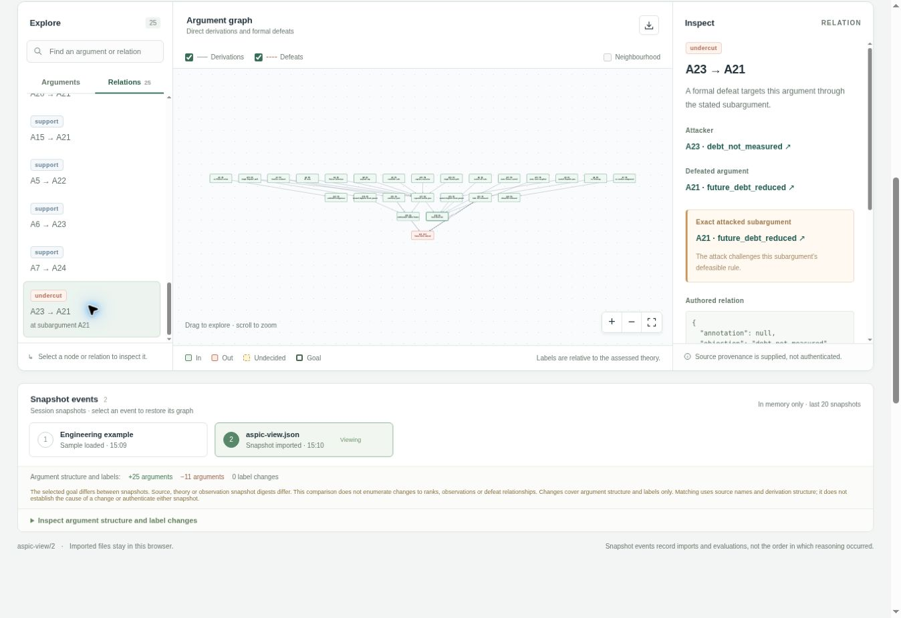
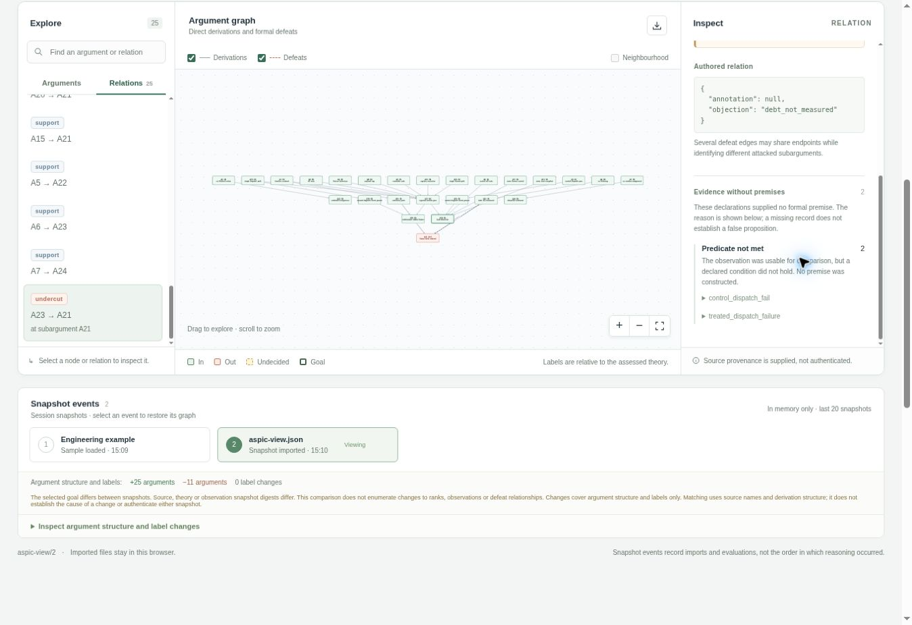
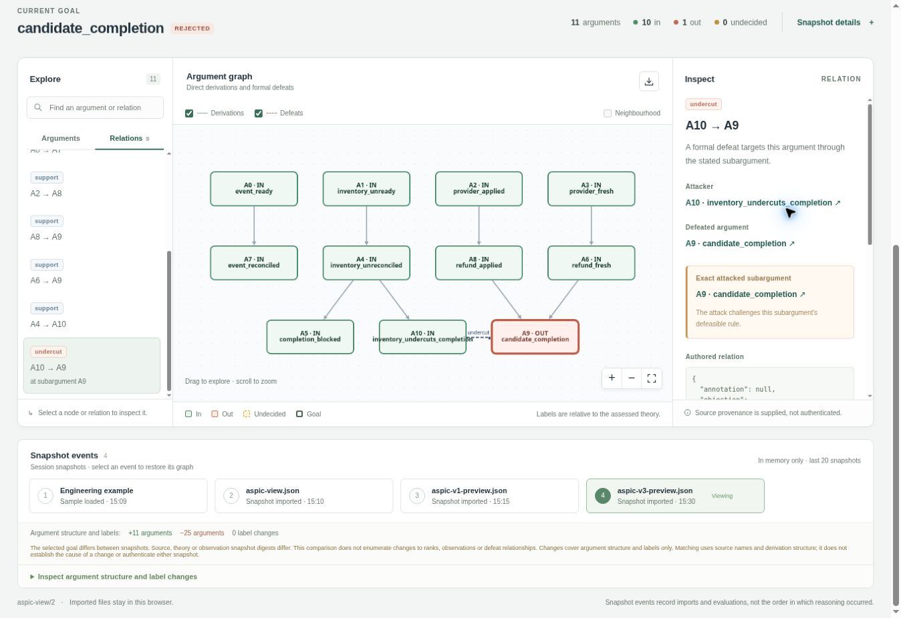

# Current-source argumentation for successive architecture changes: a bounded follow-up study

**Research report and prospective pilot, 27 September 2026.** The v1 and v2 coding outcomes below were observed in completed local experiments. The v3 apparatus and its deterministic model calculation have been tested; v3 agent coding outcomes have **not** been observed. The [prospective protocol](study/PROTOCOL.md) and task bank define what could support a later claim. Neither an accepted argument nor a working cost calculator establishes that EAL/2 reduces technical debt.

## Abstract

An earlier notification-service experiment displayed `A21 · future_debt_reduced` as defeated and two failed-dispatch evidence declarations as unavailable. The graph correctly withheld its forecast: a recorded absence of later maintenance undercut the inference from local architecture checks to later debt reduction. The two failed-dispatch predicates did not match their successfully collected, passing checks; neither route supplied a failure premise. A more demanding fulfilment-service experiment subsequently gave a fresh agent the same partial-return requirement with and without a pre-A EAL/MCP packet. Both outputs passed all 15 independent Boolean checks. This tie did not measure later maintenance.

We make a narrower intervention testable. A host now binds an EAL/2 assessment to each *current* candidate tree, acquires deterministic source, visible-test, import and port-boundary observations, and delivers a compact, defeasible argument through an actual MCP exchange. A plain-evidence arm receives the same observations and advice through the same source collector without running EAL; an ordinary arm receives the code and brief alone. Deferring a full explanation on an uncontested source cut the host-only MCP wire by 86.3% against an eager-explanation ablation in this fixture, although EAL still cost more host time than the direct plain tool. A separate, pinned implementation of the user-supplied technical-debt equation calculates a stipulated synthetic scenario and returns `not_estimable` for the real candidate without the required maintenance inputs. The prespecified pilot follows two B–C–D feature sequences and tests independent conformance, later change time and cost. Its coding results are pending, so no substantial coding effect or saving is claimed here.

## 1. Interpret the graph in the context of the engineering claim

The engineering decision is whether a later agent should extend the established functional path, or revise a shared contract when a new functional or quality requirement exceeds its seam. SOLID principles and design patterns help locate responsibilities and possible extension points; they do not require an interface for every feature. The intended benefit arises only if subsequent changes avoid duplicated state transitions and narrow the number of places that must be edited, while still meeting behaviour, reliability and performance obligations. Repeated exposure to a static prose rule can be stale, distract the agent or reinforce a poor existing architecture. The relevant comparison is therefore a *current, source-bound* decision with a credible plain-evidence comparator and later changes that can reveal maintenance cost.

The [v1 post-run EAL source](../architecture_extension/observed-results.eal), [ASPIC export](../architecture_extension/results/aspic-view.json) and [run summary](../architecture_extension/results/eal-run.json) explain the screenshot precisely. `debt_prediction` (`A21`) concludes only that keeping the argument in context **may** reduce future duplicate paths and drift, conditional on continued adherence. `debt_not_measured` (`A23`) attacks that particular defeasible inference using `no_followup`, which reports `longitudinal_followup.passed == false`. The grounded graph rejects the forecast route at this snapshot. It has not measured a debt increase or proved future EAL use ineffective. Both `control_dispatch_fail` and `treated_dispatch_failure` ask for `single_dispatch_path.passed == false`. Their matching success declarations consume the **same** collected checks, whose values are `true`. The failed-check routes are unconstructed because the negative predicates were not met; they did not suffer a missing tool response. The original visualisation's general “Unavailable evidence” wording elided this distinction. A typed absence reason in the updated export/view separates a predicate mismatch from an acquisition failure without changing the frozen v1 observations.

The corresponding [visualiser PR #3](https://github.com/emmett08/aspic_visualisation/pull/3) and [Cloud Browser capture record](screenshots/README.md) show a fresh `aspic-view/2` export of those same observations. The earlier `aspic-view/1` record and its screenshot remain historical; the /2 producer and consumer classify failed predicates and acquisition problems explicitly.

*Figure 1.* [Cloud Browser exact-undercut capture](screenshots/exact-undercut.jpg) from the production build, with the selected `A23 → A21` relation.

*Figure 2.* [Cloud Browser predicate-not-met capture](screenshots/predicate-not-met.jpg). Neither negative declaration supplies a premise while `passed == true`.

The whole–part audit forces each inference to carry its own measurement and reversal conditions:

| Part of the practical claim | Direct observation or instrument | What it can warrant | Missing premise, defeater or rival |
| --- | --- | --- | --- |
| One coherent order lifecycle remains available | Source-bound port declarations, injected service and import checks; exact changed paths and effect call sites | A bounded review of the *current* tree | Static calls do not prove unique mutation, dead-code absence, concurrency safety or a suitable replacement boundary. A deliberate migration can make the old signature check fail while improving the design. |
| New requirements work | Candidate-visible tests during coding; separately sealed independent assessor afterward | Explicit test verdicts for cases exercised on the candidate digest | Passing editable tests is not final conformance; import/assessor errors are invalid measurements, not failed behaviour. |
| A later agent used argument guidance | Delivery record, exact packet and MCP trace | The specified intervention was offered to that agent | Delivery does not reveal attention, understanding or the cause of the resulting code. |
| Architectural drift and redundant paths were avoided | Masked source review locating mutation routes, obsolete code and changes across episodes | A bounded structural comparison, with concrete locations | Finite probes and AST indicators cannot prove the absence of every path; reviewers can disagree. |
| Later changes cost less | Timed C and D episodes with conformance held to the same standard, measured provider/tool expenditure and follow-up rework | A local comparative outcome when assignment and ledgers are valid | Different sessions, task familiarity, model drift, leakage or unmeasured effort can mimic an effect. The earlier v1/v2 snapshots have no such outcome. |
| Technical-debt value differs | Common demand/work cohorts, unit costs, attainable equivalent reference, remedy and time horizon | A conditional model calculation, with uncertainty and prospective validation | A Cognitive Complexity score, local test pass or synthetic model input does not identify these quantities. Missing inputs produce `not_estimable`. |

This preserves three levels of claim. The EAL/ASPIC engine can formally assess a *specified* defeasible inference under acquired premises. A candidate can pass measured engineering obligations. Only a controlled comparison of later, comparable work can support the intended downstream effect. Treating these levels as interchangeable would recreate the very overstatement exposed by `A21`.

## 2. Earlier completed experiment and its limit

The first [notification case](../architecture_extension/paper.md) had a 9/9 fixed-check tie after email was extended by SMS. Its formal report supported a local tie and left the debt forecast contested. The stronger [fulfilment case](../architecture_extension_v2/paper.md) began with a Python service covering pricing, stock, payment, shipping, order persistence and an event outbox. Engineer 2's A agent implemented split multi-warehouse fulfilment after a real pre-A EARL MCP acquisition. Its exact output became both B agents' common source. Engineer 3's B agents received the same partial-return brief and requested model/effort class; the treatment received an EAL/MCP context packet. A passed 10/10 independent checks; both B outputs passed **15/15**. The masked review found no confirmed independent checkout path, port bypass, import cycle or genuinely unused production function in either B tree. The pinned Python Cognitive Complexity totals were 140 in treatment and 145 in control; these different placements of branching do not constitute five units of debt. A post-run known pre-effect refund-failure case favoured the treatment's ability to accept a different return ID, but it was discovered after the fixed primary tests and is exploratory. Full checks, snapshots, source patches and packets are linked from that report.

The v2 packet was 33,982 bytes and described the **pre-A** source even when delivered to B; the B agents themselves could inspect the changed A source. This was genuine MCP delivery but a stale-evidence risk and high agent-context footprint. The observed primary contrast was zero on the fixed checks. It does not show an EAL benefit, equivalence across possible tasks or a reliable adverse effect. It motivates refreshing observations at each stage and isolating the informational value of deterministic evidence from the additional value of formal argumentation.

Repository context can be costly or harmful if it imposes unnecessary requirements: Gloaguen and colleagues' [evaluation of `AGENTS.md`](https://arxiv.org/abs/2602.11988) reports lower task success and more than 20% higher inference cost across their settings. Conversely, [CodePlan](https://arxiv.org/abs/2309.12499) provides evidence that dependency and impact planning can help on its six repository-level tasks; [SWE-agent's interface ablation](https://proceedings.neurips.cc/paper_files/paper/2024/file/5a7c947568c1b1328ccc5230172e1e7c-Paper-Conference.pdf) demonstrates that tool/interface design can affect coding results. Those are studies of different treatments and populations. They motivate a compact interface and a serious cost comparator; none supplies an estimated EAL effect in this fulfilment system.

## 3. Current-source EAL/MCP mechanism

The [v3 EAL source](argument.eal) has a `current-snapshot` environment. Its paired pass/fail declarations ask the pinned [`snapshot_probe`](snapshot_probe.py) for the same source-bound Boolean observation. The [TOML binding](tool.toml) pins the checker bytes, timeout and maximum output. The host rejects changed source digests or malformed observations. Positive and negative premises therefore come from an explicit verdict; a failed acquisition or unknown dynamic effect cannot silently count as a negative finding. Strict directives connect only explicit check reports to their local verdicts. The ordinary review route has named objections for failed visible tests, import cycles and a changed port boundary. A separate migration route advises reviewing the replacement contract and all affected paths when the old syntax changes, expressly withholding any verdict on replacement conformance. Host-specified change-surface hypotheses draw on public requirements and the known A-stage ports; they are review leads shared by P1/P2, not requirements in the feature briefs or facts obtained from the sealed assessor. None of these static premises asserts future debt reduction.

For each B, C and D source snapshot the [host](host.py) copies the candidate into an immutable assessment workspace, hashes the exact code and checker, and invokes bounded collectors. P2 records MCP `tools/list`, `eal_assess_artifact_claim` and `eal_finish_artifact_claim` exchanges; a scoped `eal_explain_artifact_claim` is requested when the verdict needs detailed inspection or later host audit. P1 invokes the same deterministic collector directly and retains a comparable plain-tool trace without EAL/MCP. Both packets contain the same factual checks, general architectural advice, deterministic next verification choice and byte budget; P2 adds claim/route/objection statuses and provenance. The host-only `explain` retrieval does not create extra agent-visible content. The coding worktree contains the current brief and assigned packet, with a recorded manifest of every visible file. Each packet is capped at **3,072 bytes**. Static call-site counts, an import graph and changed paths are review leads, not guarantees of one effect route or complete reachability. The sealed final assessor is outside the collector and its case verdicts are never packed into the agent context.

The arms isolate increasingly specific explanations:

| Arm | Agent-visible addition to common code, architecture document, tests and current brief | Question answered by comparison |
| --- | --- | --- |
| P0 ordinary | No special evidence packet | Does the combined evidence-and-argument package help beyond normal repository context? |
| P1 plain | Current deterministic facts, bounded impact/review guidance, explicit limits | Is the source-bound evidence itself sufficient? |
| P2 EAL/MCP | Matched facts and guidance, plus EAL/ASPIC status, attack structure and provenance from real MCP assessment | Does formal argument delivery add a material benefit beyond P1? |

This is a **bundle** comparison. P2 changes source refresh, argument semantics and delivery format relative to P0; a P2–P0 difference alone cannot identify the formalism. P2–P1 is the narrower contrast, but packet formatting and attention can still mediate it. The user-facing briefs contain only feature requirements, with no SOLID instruction or implementation plan. `AGENTS.md` in each isolated clone directs the agent to its current brief and assigned context file without disclosing another arm or future requirement.

### A bounded refund-status decision gate

Feature R-D creates a particularly consequential reasoning boundary: after a refund acknowledgement is lost, “not observed as applied” cannot be converted to “not applied”, and an applied refund alone does not establish inventory or event reconciliation. The separate [release-gate argument](release_gate/argument.eal), [pinned TOML tool](release_gate/eal-tools.toml) and [synthetic provider/ledger collector](release_gate/tool.py) express this at one stable operation key. A fresh `applied` report plus affirmative, separately acquired inventory and event status permits completion; a fresh explicit `not_applied` permits only a same-key retry. `unknown`, explicit `unavailable`, stale status, unreconciled obligations and tool acquisition failure block completion at the evidence cut. The objection to provisional completion in the applied-but-unreconciled case undercuts the exact subargument rather than declaring that the refund did not occur.

The [paired decision-table run](release_gate/results.json) exercised seven stipulated cases. The EAL/MCP result and a strong, direct [plain-rule comparator](release_gate/tool.py) agreed in all seven: one `COMPLETE`, one `RETRY_SAME_KEY`, five `BLOCK_COMPLETION`. The applied-but-unreconciled case constructed an ASPIC undercut; the simulated provider tool error was recorded as an acquisition failure and defaulted to block without fabricating a provider-status premise. This tests the finite rule wiring and auditable reasons. The plain deterministic rule was equally safe on these fixtures, while its in-process calculation avoided the fresh MCP server cost. No agent implemented R-D in this validation, and no live provider outcome, later maintenance saving or coding performance effect was measured. A comparator that treats silence as failure would be unsafe by construction and would not be a fair baseline.

*Figure 3.* [Cloud Browser gate capture](screenshots/synthetic-release-undercut.jpg) from visualiser PR #3 selects the `A10 → A9` undercut. Its [typed predicate panel](screenshots/synthetic-release-predicate.jpg) and [capture provenance](screenshots/README.md) distinguish successful acquisition from an unmatched predicate in this synthetic fixture.

## 4. Technical-debt measurement and cost of the intervention

The [implemented model](technical_debt/README.md) evaluates the equation from the user-supplied *A language-agnostic cost model of technical debt* for assessed implementation `a` and a feasible, service-equivalent reference `r`:

\[
D_H(a\mid r)=\delta^H P+g_H(\delta)\bigl[c_a^\mathsf{T}(I-B_a)^{-1}M_a\lambda-c_r^\mathsf{T}(I-B_r)^{-1}M_r\lambda+\ell_a-\ell_r\bigr],\qquad
g_H(\delta)=\sum_{t=0}^{H-1}\delta^t.
\]

Here `lambda` is common external change demand per period, `M` maps it to initial work, `B` maps a parent episode to directly induced work, `c` prices work, `ell` captures separately attributed periodic cost, `P` is terminal remediation expenditure and `delta` discounts one period. The derivation assumes a declared work cohort convention, stationary first moments, complete attribution and subcritical propagation. A negative carrying difference is permitted; the terminal principal may still make the total positive. The pure Python [calculator](technical_debt/tool.py) uses exact rational linear solves, checks dimensions, units, candidate and scenario SHA-256 bindings and a positive subcriticality witness, and fails closed on malformed or unstable inputs. The [debt-specific EAL source](technical_debt/debt-model.eal) and [TOML registry](technical_debt/eal-tools.toml) oppose `estimated` and `not_estimable` predicates on one actual empirical observation; the missing-input objection attacks only an *empirical projection* route. This calculation is on demand, outside every coding episode's short context packet.

The attached synthetic coefficients yield `J ≈ £3,365.44` per stipulated month and `D_12 ≈ £50,601.15` under the stipulated prices and discount. These are implementation-check figures, **not** measured costs in the fulfilment case. The incomplete empirical scenario records no candidate-bound demand/work ledger, reference and remedy; its status is `not_estimable` with missing fields, not zero or evidence against the hypothesised benefit. A real estimate requires dated root change cohorts, observed induced work and cost attribution, an attainable comparable reference, remediation price and out-of-sample prediction checks. When `B` cannot be identified, direct paired carrying-cost differences are a preferable observational estimand. An interval or sensitivity analysis must propagate parameter and reference uncertainty; a solver residual only checks arithmetic. Monetary model output must not be added to already counted maintenance expenditure. The [pinned Python Cognitive Complexity instrument](../architecture_extension_v2/metrics/cognitive_complexity.py), based on SonarSource's [white paper](https://www.sonarsource.com/docs/CognitiveComplexity.pdf), remains a per-function control-flow diagnostic and cannot stand in for work demand, induced edits, service equivalence or money. Its declared Python scope and [documented reference comparison](../architecture_extension_v2/paper.md) are reproducible; it is not a universal, all-language Sonar implementation or a complete technical-debt measurement. It is run on sealed snapshots as a secondary outcome, not as a premise that can automatically pass the current-source EAL review or the empirical debt estimate.

Tooling also has a cost. The 3,072-byte packet cap is a **byte** limit, not a measured token saving or financial saving; the old 33,982-byte packet is a different payload and cannot serve as a matched P1 comparator. A [same-revision host microbenchmark](results/host-benchmark.json) ran five interleaved measurements per condition, after one warm-up, against the same frozen v2 A source and R-B brief; all conditions had the same observation digest. P1 emitted 1,794 agent-facing bytes with median 0.250 s wall and 0.250 s total host/child CPU. P2 with an on-demand explanation emitted 2,335 bytes with median 1.278 s wall and 1.281 s CPU; its host-only MCP wire was 10,850 bytes, versus 7,118 bytes of P1 direct tool exchange. The P2 **eager-explanation ablation** emitted the same 2,335-byte packet but sent 79,290 internal wire bytes and took median 1.411 s wall and 1.413 s CPU. Deferring that uncontested explanation saved 68,440 internal bytes (86.3%) and 0.133 s median wall (9.4%) *within this host fixture*. P2 still incurred about 1.028 s more host wall time per assessment than P1. Disabling the normal P2 cache gave 1.299 s median wall versus 1.278 s enabled, a small, noisy difference with no demonstrated cache saving. The timestamped traces and process figures are apparatus overhead, **not** agent tokens, provider expense, coding time or an observed maintenance benefit.

For each coding arm, record packet bytes, *actual* model input/output/cache tokens, host CPU and wall time, MCP and checker calls, prices with date, coder elapsed time, human intervention and later correction work. If provider usage or prices are missing, report each measured unit separately without inventing a total. For `n` comparable episodes, economic break-even requires the measured reduction in verified change/rework cost to exceed the additional authoring, host, tool and model-context cost over the same horizon, with one-time authoring allocated by a declared amortisation rule. Packet construction and caching belong in the numerator of P1/P2 overhead; counting only the short text delivered to the model would hide work. A persistent server, batching or a narrower requested subargument might change cold-start and transport cost; this benchmark does not measure those variants. Token counts across model classes require their actual provider tokenizer/ledger rather than a bytes-to-tokens constant.

## 5. Prospective end-to-end test and decisions

The [task bank](study/task-bank.json) fixes two sequences from the **same** v2 A tree. Family R grows partial returns (B), post-dispatch cancellation (C), then uncertain refund acknowledgement and reconciliation (D). Its latter choices are informed by the v2 exploratory finding and hence developmental. Family W adds warehouse availability (B), carrier substitution (C) and bounded ordered outbox delivery (D); it is reserved before v3 coding output, but shares the same codebase. Each sequence crosses stock, payment, shipping and persistent order/event effects, so locally correct extra paths can make later changes expensive. One entire B–C–D clone is the assignment unit. Three arms × two families imply six planned clones and 18 planned coding episodes, not 18 independent experimental units or observed results. Engineer prompts include the current requirement alone, plus workdir logistics; the arm context is mounted by the host. A predeclared model/class may differ by stage, but P0/P1/P2 must use the **same** exact stage profile and resource cap within a family. A changed profile requires a separate complete arm block, not a one-arm substitution.

Before coding, [`freeze.py`](study/freeze.py) is to bind source, briefs, argument, collector, tool registry, harness, independent assessor, analysis rules and matched allocation. Agents must not see future briefs, other clones or the assessor in their worktrees. Repository-public materials or network access remain potential leakage; worktree isolation alone cannot provide a concealed confirmatory trial. The host logs packet delivery and a whole-code-tree digest; the independent assessor separately hashes its declared subset of Python and architecture-document inputs. The [ledger analyser](study/analyse.py) recomputes each digest under its **own** recipe from the retained immutable candidate and checks the corresponding record, rather than equating two different hashes. The assessor, outside the coding workspace, re-runs due earlier checks and new cases on every episode and records `pass`, `fail` or `invalid`. Condition-masked reviewers identify specific duplicate mutation routes, port bypass, outbox conflicts and reachable obsolete code; a reviewer finding is distinct from a static smell count. No arm gets a hidden-test repair instruction. Failed attempts and timeouts stay in the assigned denominator.

The [GitHub workflow](../../.github/workflows/architecture-extension-v3.yml) has a pull-request path for deterministic freeze, EAL/MCP, tool and assessor checks, and a separately triggered live coding path using six clone workspaces. It permits predeclared stage-specific agent classes/models while matching all three arms at each stage. A green preflight validates the apparatus, not the unrun live jobs or an EAL coding effect. Model credentials and provider usage are unavailable in this local report; no workflow-run coding outcomes are included.

The within-family estimands are the ordered independent-conformance-vector contrasts `Y_i(P2) − Y_i(P0)` and `Y_i(P2) − Y_i(P1)`, and corresponding restricted C+D elapsed-time contrasts `T_i(P2) − T_i(P0)` and `T_i(P2) − T_i(P1)`, for family `i ∈ {R,W}`. The [prespecified decision](study/PROTOCOL.md) requires P2 to pass every critical invariant, have no lower verified completion or masked structural quality, and take **at least 25% less restricted C+D coding time than both P0 and P1 in both families** for a substantial *local time* feasibility result. Each episode has the same 30-minute wall cap; an unsuccessful episode contributes the cap to this restricted-time decision and remains separately labelled as failed/censored. If the runner cannot enforce and timestamp the cap, the time decision is unavailable. Provider and tool expenditure form a separate cost outcome; a time advantage alone is not a monetary saving. One task-family block per arm cannot estimate an effect across repositories, support a population p-value or establish modelled debt reduction. A subsequent confirmation requires independent systems, assignment units, follow-up cohorts and a sample-size calculation based on pilot variation, while keeping R's post-run-inspired tasks out of an independent holdout.

## 6. Results recorded at this revision

| Record | Verified observation | Permitted inference |
| --- | --- | --- |
| V1 post-run EAL/ASPIC and the historical and refreshed Cloud Browser captures | `A21` debt route rejected by the no-follow-up undercutter; both failed-dispatch evidence predicates did not match passing observations; local fixed checks tied 9/9 | Formal forecast lacks a premise; negative-dispatch advantage is unconstructed. Neither status refutes a later benefit. |
| V2 full local E2E sequence | Engineer 2 A passed 10/10; both Engineer 3 B outputs passed 15/15; masked architecture review found no confirmed duplicated checkout path in either | No primary B advantage on these probes; no later maintenance measurement. |
| V2 metric and exploratory probe | Cognitive Complexity 140 P2-like treatment versus 145 control; known pre-effect refund failure differed after primary tests | Different control-flow placement and a hypothesis for a future task, not measured debt or a confirmatory EAL effect. |
| Debt calculator validation | Ten unit tests passed; attached synthetic `J` and `D_12` reproduced; a 15-message real MCP demonstration accepted the empirical input-gap claim | Conditional arithmetic and evidence-status wiring function for the tested cases; real debt reduction remains unestimated. |
| V3 host microbenchmark | Same source/observation digest, five measured repetitions each: P1 1,794 B/0.250 s median wall; P2 on-demand 2,335 B/1.278 s/10,850 B internal wire; P2 eager 2,335 B/1.411 s/79,290 B internal wire | On-demand explanation substantially reduces internal transfer on this fixture, yet formal host remains slower than plain; no agent tokens or coding outcome measured. |
| V3 refund-status gate, synthetic | EAL/MCP and strong direct rule agree on seven decisions: one completion, one stable-key retry and five holds; exact undercut for an unreconciled applied refund | Finite formal safety rule and error handling validated; no advantage over the matched plain rule or real payment effect demonstrated. |
| V3 coding comparison | Protocol and apparatus specified; no assigned B–C–D candidate outcomes in this revision | No substantial time, cost, conformance or debt difference can yet be inferred. |

The [technical-debt MCP summary](technical_debt/mcp-demonstration.json) binds its EAL and TOML hashes and [compressed JSON-RPC transcript](technical_debt/mcp-demonstration.json.gz). A live v3 coding report must append the frozen manifest digest, allocation, every arm and stage source digest, independent finding vector, exposure manifest, MCP trace, packet and actual usage/cost ledger. Editing an outcome or excluding a failure after reading results would turn the registered contrast into a selected case. The paper should be updated with **observed** trial records only after they exist.

## 7. Conclusion

The screenshot identified a real limit of the original argument, not a syntactic incompleteness: local architecture evidence does not imply a future debt outcome. The repaired measurement path asks the cost model its precise, candidate-bound question and records why the answer is unavailable; the current-source host makes immediate design advice inspectable at a bounded agent-facing byte cost, while its total compute and model cost remains to be measured. The decisive unresolved question is empirical: whether EAL/ASPIC status adds a reproducible improvement beyond the same deterministic evidence, at a total cost that later verified maintenance savings exceed. The prospective three-arm, successive-change study can expose a substantial *local* effect or a null/adverse outcome, but the completed v1/v2 results and synthetic model do not preselect its answer.
